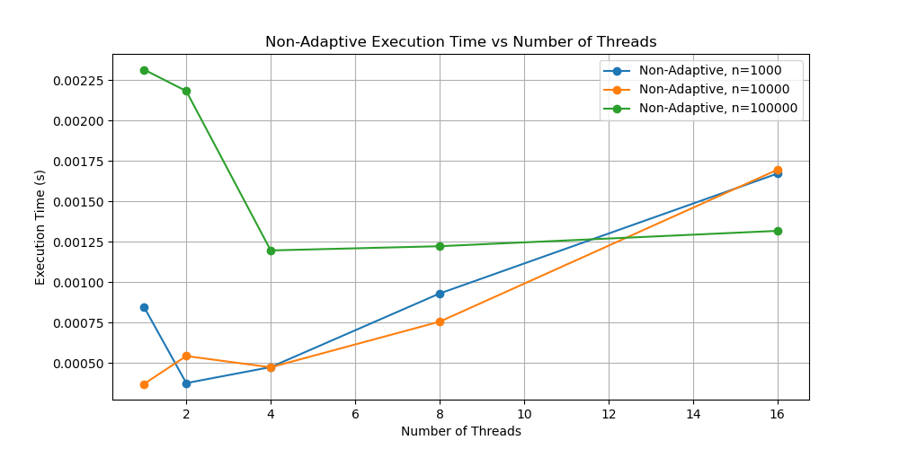
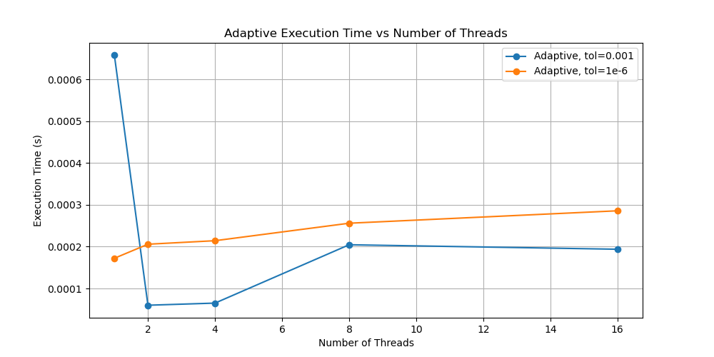

# Numerical Integration using Parallel and Adaptive Methods

## Overview
This report presents the implementation and analysis of parallel numerical integration using the trapezoidal rule. The goal is to optimize integration tasks, analyze scalability, and ensure robustness of the parallel implementation. The methods tested include:
- **Part 1**: Parallel Non-Adaptive Integration
- **Part 2**: Parallel Adaptive Integration
- **Part 3**: Performance and Scalability Analysis
- **Part 4**: Validity and Robustness Evaluation

This summary highlights performance, scalability, and robustness based on different thread levels and input sizes.

## Part 1: Parallel Non-Adaptive Integration
The non-adaptive trapezoidal rule was parallelized and tested with thread counts (\( t = 1, 2, 4, 8, 16 \)) and interval sizes (\( n = 1000, 10000, 100000 \)).

- **\( n = 1000 \)**:
  - Integral values fluctuated slightly around zero, matching the expected result.
  - Execution time decreased as threads increased but slightly worsened with 16 threads due to thread overhead.

- **\( n = 10000 \) and **\( n = 100000 \)**:
  - Similar execution time patterns were observed, with diminishing returns for higher threads.
  - Errors increased with more threads due to rounding and floating-point addition issues.

### Execution Time and Load Balancing
- For smaller \( n \), the benefit of more threads was outweighed by management overhead.
- For larger \( n \), parallelization showed improvement up to 8 threads, but with diminishing returns after that.

## Part 2: Parallel Adaptive Integration
The adaptive trapezoidal method dynamically subdivides intervals to improve accuracy. The results are summarized below:

- **Tolerance \( \epsilon = 10^{-3} \)**:
  - All configurations produced an integral of **0.305335** with 25 evaluations.
  - Execution time decreased significantly up to 8 threads.

- **Tolerance \( \epsilon = 10^{-6} \)**:
  - All configurations produced an integral of **0.304762** with 605 evaluations.
  - Execution time improved up to 8 threads but increased with 16 threads due to synchronization overhead.

### Load Balancing and Adaptive Behavior
- For tighter tolerances (\( \epsilon = 10^{-6} \)), more function evaluations were needed.
- Efficiency improved up to 8 threads, but thread management overhead reduced gains beyond that.

## Part 3: Performance and Scalability Analysis
Performance trends of both non-adaptive and adaptive methods were analyzed.

- **Execution Time vs. Threads**:
  - **Non-Adaptive**: Execution time generally decreased with more threads, with diminishing returns for higher counts.
  - **Adaptive**: Significant time reduction was observed up to 8 threads, but gains were limited with 16 threads.

- **Scalability and Load Balancing**:
  - Both methods scaled well up to 8 threads.
  - The adaptive method provided better load balancing through dynamic interval refinement, but synchronization overhead limited performance with more threads.
### Visual Analysis

#### Non-Adaptive Integration Performance

#### Adaptive Integration Performance

## Part 4: Validity and Robustness Analysis
Validity was evaluated by comparing parallel results to a high-precision sequential version.

- **High-Precision Result**: \( 2.3415 	imes 10^{-16} \), effectively zero, as expected.
- **Error Analysis**:
  - **\( n = 1000 \)**: Errors ranged from **\( 1.08686 	imes 10^{-16} \)** to **\( 9.00284 	imes 10^{-16} \)**, within acceptable bounds.
  - **\( n = 10000 \)**: Errors increased with thread count due to floating-point non-associativity.
  - **\( n = 100000 \)**: Errors up to **\( 5.11913 	imes 10^{-15} \)**, suggesting challenges with thread balance and accuracy.

### Robustness
- Errors were consistent with floating-point inaccuracies.
- Proper thread synchronization ensured correctness, and high-precision comparison validated accuracy.

## Conclusions
### Summary of Results
- **Accuracy**: The parallel implementation produced small errors compared to the sequential version, primarily due to floating-point rounding.
- **Scalability**: Good scalability up to 8 threads, with diminishing returns beyond that.
- **Load Balancing**: The non-adaptive method faced challenges with increased thread count, whereas the adaptive method maintained better consistency.

### Insights
- **Trade-Offs**: There is a trade-off between accuracy and performance. More threads speed up execution but may introduce small errors.
- **Efficiency**: Parallelization is effective for significant workloads. For smaller workloads (\( n = 1000 \)), fewer threads are more efficient.
- **Recommendations**: Adaptive parallelization works well with moderate threads, but care is needed to avoid high synchronization overhead.

### Questions and Answers Based on Data
1. **How does increasing threads impact performance?**
   - Performance improves significantly up to 8 threads. Beyond that, overhead reduces gains.
2. **Does the adaptive method require more computation for tighter tolerances?**
   - Yes, tighter tolerances (\( \epsilon = 10^{-6} \)) required more evaluations.
3. **What factors contribute to error in parallel versions?**
   - Floating-point precision limitations and non-associativity of addition.
4. **How well does the adaptive method balance load?**
   - Dynamic interval refinement led to better utilization, but high thread counts introduced synchronization overhead.
5. **Relationship between problem size and scalability?**
   - Larger problem sizes (\( n = 10000 \) and \( n = 100000 \)) scaled better with more threads, amortizing thread overhead.

## Conclusion
Parallel numerical integration using adaptive and non-adaptive trapezoidal methods demonstrated good performance with appropriate thread counts and problem sizes. Proper load balancing and careful thread management are key to achieving efficient and accurate results. The adaptive method is particularly effective for complex integrals requiring dynamic resolution, provided thread count is balanced against synchronization overhead.

*Plots illustrating execution time, scalability, and function evaluations versus threads can be found in the attached visual section.*

