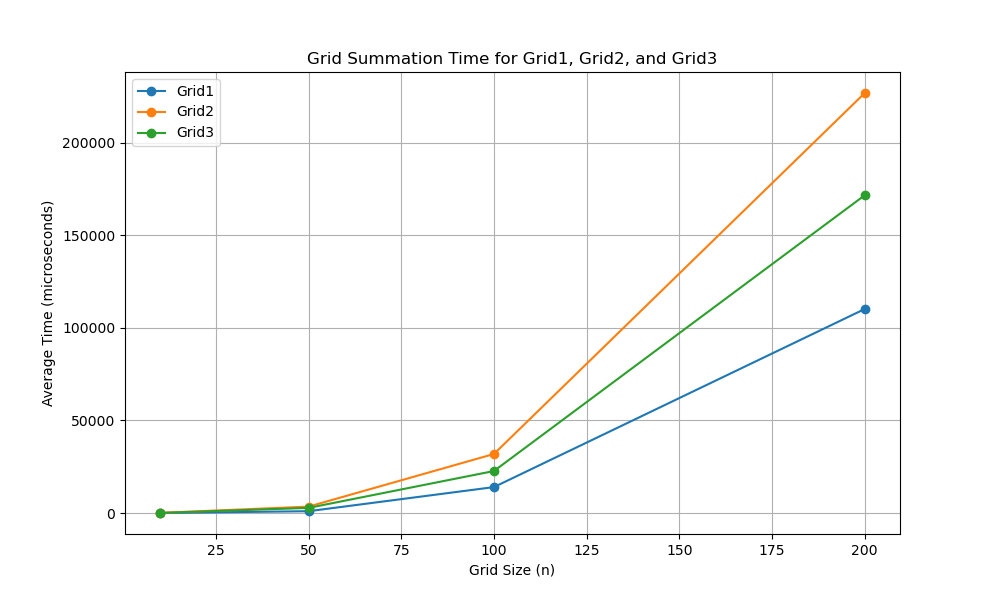

## Overview
This project implements a 3D grid class in C++ with three different approaches: using a 1D array, a 2D vector, and dynamic memory allocation (new). It supports grid element addition, access, memory usage calculations, and timing analysis for summation operations using the chrono library.

Additionally, I incorporated exception handling and AI-based improvements such as using auto for cleaner and more flexible code where appropriate.

## Grids Implemented
1. Grid1 (1D Array-Based)
A grid implemented using a 1D array that mimics 3D indexing. The constructor initializes the grid, and the overloaded + operator allows for element-wise addition.
Key Features:
Efficient memory management using a flat array.
Simple access functions with bounds checking.
Exception handling for out-of-bounds access.
2. Grid2 (Vector-Based)
A grid implemented using STL vector, which automatically manages memory allocation and provides built-in bounds checking.
Key Features:
Use of std::vector for easy memory management.
Efficient access and safe bounds checking.
Exception handling for out-of-bounds access.
3. Grid3 (new-Based)
A 3D grid implemented using dynamic memory allocation with new, where memory is explicitly managed. This allows for fine-tuning of performance and memory control.
Key Features:
Explicit memory control with new and delete.
Fine-grained control over memory layout.
Exception handling for memory allocation errors and out-of-bounds access.

## Exception Handling
Each grid class contains robust exception handling. Out-of-bounds access is detected and reported using std::out_of_range, and invalid operations (e.g., adding grids of different sizes) are reported using std::invalid_argument.

## AI-Based Improvements
Replaced explicit types with auto where appropriate, making the code cleaner and easier to maintain.
Improved exception handling for safety.
Timing functions with chrono to compare the performance of different grid types.


## Timing Analysis
We used the <chrono> library to time the execution of the summation operator for grids of sizes 10x10x10, 50x50x50, 100x100x100, and 200x200x200. The results are saved in a CSV file for analysis.

## Performance Plot
A plot was generated to display the time required for the summation of two grids using the different grid implementations. The plot was created using the timing results collected over multiple runs to ensure accuracy.


Interesting Questions Posed to AI
During the development of this project, I used AI to help with various aspects:

## How to implement exception handling: AI helped in understanding best practices for exception handling in C++, ensuring my code was robust.
Optimizing performance with auto: AI suggested replacing explicit types with auto to make the code more maintainable and flexible.
Chrono-based timing: I asked AI for help in timing the summation operations using chrono, and it provided an efficient solution that was easy to integrate.
Plotting the performance: AI helped generate Python code using matplotlib to plot the timing results, allowing me to visualize the performance differences.

## Conclusion
This project gave me hands-on experience in developing different memory models for grid implementation, handling exceptions efficiently, and optimizing performance. The AI assistance was invaluable in improving code quality, handling edge cases, and generating useful performance plots.


Here's an updated version of your README.md section with additional clarifications:

## How to Run
Using Makefile (Recommended)
Compile the project by running the following command in your terminal:
```bash
make
```
2. Run the compiled program with:
```bash
./main_grid
```
3. run the test
```bash
./test_grid
```
4. Output: After running the program, a grid_timing.csv file will be generated containing the performance timing data for the different grid types (Grid1, Grid2, Grid3).
5. Plotting the results: Use the provided plot.py script to visualize the performance timing:
```bash
python plot.py
```

Without Makefile (Manual Compilation)

If you prefer not to use make, you can manually compile the project:

Open your terminal and navigate to the project folder.

1. Compile the project with:
```bash
g++ main.cpp grid3d_1d_array.cpp grid3d_vector.cpp grid3d_new.cpp -o main_grid

```
2. Run the compiled program:
```bash
./main_grid
```
3. After running ./main_grid, a grid_timing.csv file will be generated.
4. To plot the results, run the Python plotting script:
```bash
python plot.py
```
Output File
The grid_timing.csv file will contain timing data for grid summation for various grid sizes (n=10, n=50, n=100, n=200).
You can analyze the performance of each grid type (Grid1, Grid2, Grid3) by visualizing the data using plot.py.