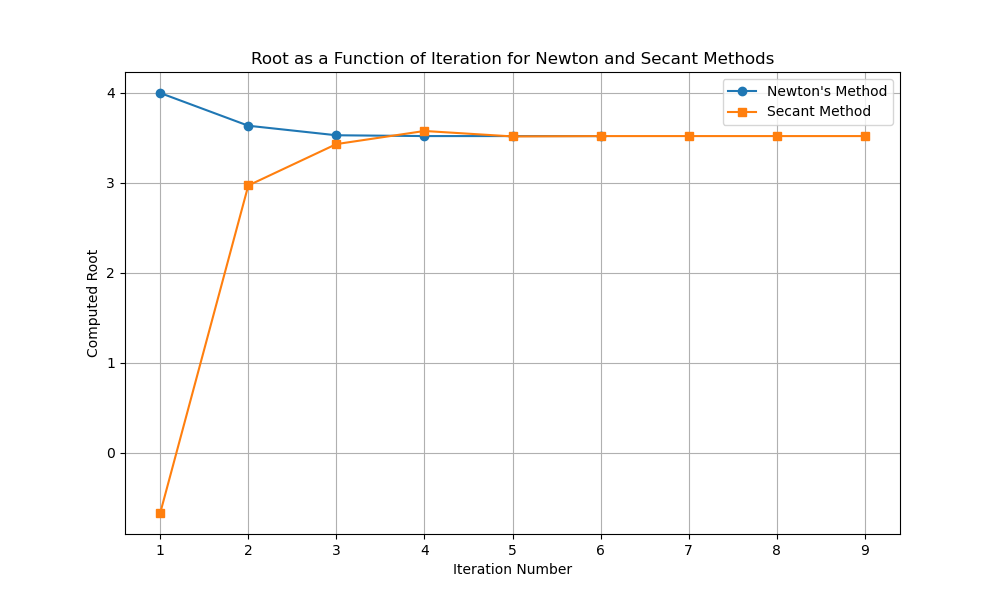

# C++ Homework Assignment - Week 04

## Overview

This project implements various C++ programs to solve equations using numerical methods like Newton's method and the Secant method. The project demonstrates techniques for managing memory in C++ using manual memory management and smart pointers, as well as specialization for different data types like `double` and `float`.

## Repository Structure

This repository contains the following files:

- `main.cpp`: The main program implementing the numerical solvers with `double` precision.
- `main_plot.cpp`: A variant of `main.cpp` that logs the iteration data for plotting convergence.
- `main_no_delete.cpp`: Same as `main.cpp` but using smart pointers (`std::shared_ptr`) to avoid manual memory management (`delete` statements).
- `main_float.cpp`: A version of `main.cpp` specialized for `float` precision.
- `function.h`: Header file containing the mathematical functions (e.g., `sin`, `log`, cubic function).
- `solver.h`: Header file that defines the Newton and Secant solvers.
- `Makefile`: Automates the build process for compiling the different executables and cleaning up build files.
- `plot.py`: Python script to plot the iteration data generated by `main_plot.cpp`.


## Interesting Questions Posed to the AI

During the development of this project, several interesting questions were posed to the AI, which helped resolve various issues and enhance the project. Here are some highlights:

### 1. **How can I specialize a program for `float` instead of `double`?**
   - **Problem**: I wanted to create a version of `main.cpp` that uses `float` instead of `double` for all floating-point operations.
   - **Solution**: The AI guided me in replacing all instances of `double` with `float` and adding `f` suffixes to floating-point literals (e.g., `1.0f`), which ensures that the program uses single-precision floating-point numbers.

### 2. **How can I implement memory management using smart pointers (`std::shared_ptr`)?**
   - **Problem**: I needed to modify `main.cpp` to avoid manual memory management using `delete` and instead use smart pointers (`std::shared_ptr`).
   - **Solution**: The AI suggested using `std::make_shared` to create the smart pointers, which would automatically manage the lifetime of the dynamically allocated objects. This eliminated the need for `delete` statements and made the program safer and more modern.

### 3. **Why isn’t the `clean` rule working in my Makefile?**
   - **Problem**: Running `make clean` on a Windows system resulted in an error because the `rm` command isn’t recognized by the native command prompt.
   - **Solution**: The AI provided a cross-platform solution that uses `rm` on Unix-like systems and `del` on Windows. It also handled the case where the file might not exist, ensuring smooth execution across different environments.

### 4. **How can I export data from the solvers to analyze convergence?**
   - **Problem**: I wanted to track the root values during each iteration and export them for further analysis and plotting.
   - **Solution**: The AI suggested modifying the solvers to log the computed roots at each iteration and export the data to CSV files. This allowed me to plot the convergence of the numerical methods.

## Compilation Instructions

This project includes a `Makefile` to simplify the compilation process. You can compile all programs or specific ones as needed.

### To compile all programs:

```bash
make
```

## Project Photo

Here is a photo of the project in action:



