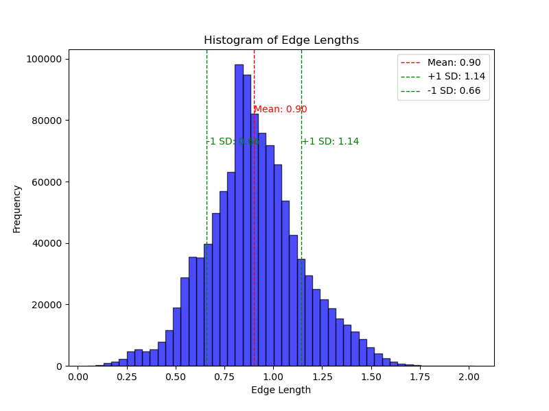
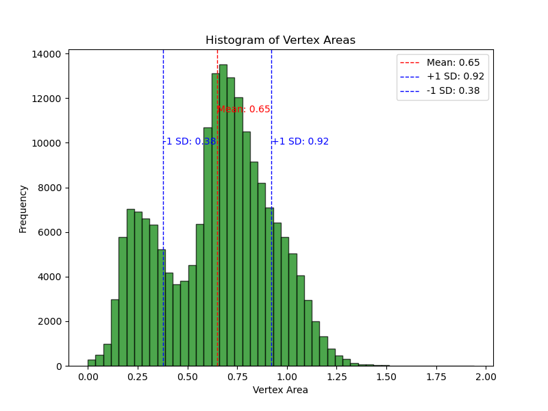
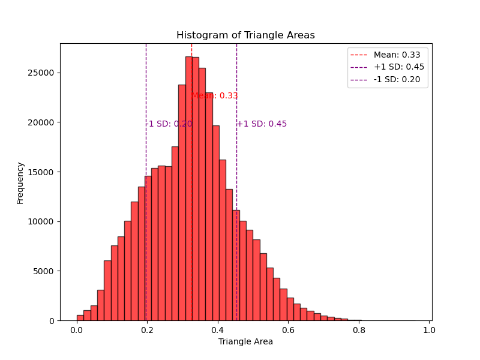

# Brain Mesh Analysis Project

## Overview
This project involves analyzing brain mesh structures using C++. The project includes reading mesh data from `.vtk` files, computing geometric properties like surface areas, and generating visualizations using Python. The analysis is split into two main components: calculating mesh properties and validating results through unit tests.

## Purpose of the Assignment
The purpose of this assignment is to gain hands-on experience in reading, processing, and analyzing 3D mesh data representing brain structures. Through this project, students learn how to:

- **Read and parse 3D mesh data** stored in the `.vtk` (Visualization Toolkit) format, a common format used in computational geometry and medical imaging.
- **Calculate geometric properties** such as the total surface area of the mesh, areas associated with each vertex, and lengths of edges between mesh points.
- **Visualize computed data** using histograms to better understand the distribution of the computed values, such as edge lengths and vertex areas.
- **Test the correctness** of computational methods through unit tests using simplified datasets.
- **Develop cross-platform C++ programs** and automate the build process using `Makefile`.

### Real-World Applications
The skills and concepts applied in this assignment have several real-world applications, particularly in the fields of neuroscience, medical imaging, and computational geometry:

- **Brain Structure Analysis**: In neuroscience research, 3D models of brain structures are often analyzed to study the morphology and geometry of different brain regions. This project simulates such an analysis by working with mesh representations of cortical surfaces.
- **Medical Imaging and Visualization**: Reading and processing `.vtk` files is a common task in medical imaging. This project provides experience in handling this data format, which is widely used in software like 3D Slicer and ITK (Insight Segmentation and Registration Toolkit).
- **Computational Geometry**: Calculating surface areas, vertex-associated areas, and edge lengths are fundamental tasks in computational geometry, used in fields such as computer graphics, virtual reality, and CAD (Computer-Aided Design).
- **Mesh Quality Control**: Understanding how to calculate and analyze the geometric properties of meshes can help in quality control of 3D models. It allows researchers and engineers to ensure that their models accurately represent the structures they are studying.
- **Data Visualization**: The Python scripts used for visualizing computed data help students understand the importance of visual representation in data analysis, which is crucial for communicating complex results effectively in scientific research.

## Project Structure
Here is a detailed description of the files included in this project:

### C++ Source Files
- **`main.cpp`**: 
  - The primary C++ program that reads brain mesh data from a `.vtk` file, computes the total surface area, calculates vertex areas, and saves the results to text files.
  - Uses the `BrainMesh` class to perform these computations.
  - Includes options for calculating surface areas in both `float` and `double` precision.

- **`test.cpp`**: 
  - A separate C++ program for unit testing the `BrainMesh` class.
  - Verifies the correctness of area calculations and edge lengths using a simple, known geometry (a manually defined triangle).
  - Uses assertions to ensure that computed values match expected results.

- **`brain_mesh.h`** and **`brain_mesh.hxx`**:
  - Header files that define the `BrainMesh` class template and its member functions.
  - Responsible for reading mesh data, calculating areas of triangles, and computing areas associated with vertices.
  - Supports both single (`float`) and double (`double`) precision calculations.

### Python Visualization
- **`analysis.py`**:
  - A Python script that reads data from the output files (`edge_lengths.txt`, `vertex_areas.txt`, `triangle_areas.txt`) and generates histograms.
  - Plots histograms for edge lengths, vertex areas, and triangle areas with annotations for mean and standard deviation.
  - Uses `matplotlib` and `numpy` for visualization and numerical computations.

### Input Data
- **`Cort_lobe_poly.vtk`**:
  - The input file containing brain mesh data in VTK format. This file is read by `main.cpp` to extract vertex and triangle information.

- **`test_file.vtk`**:
  - A simplified `.vtk` file used for testing purposes in `test.cpp`. Contains a small set of vertices and triangles with known areas for validation.

### Makefile
- **`Makefile`**:
  - Automates the compilation of `main.cpp` and `test.cpp` into separate executables.
  - Provides targets to build (`make`), clean (`make clean`), and run tests (`make test`).
  - Ensures that executables are placed in the `bin` directory for better organization.

## What ChatGPT Helped With
ChatGPT assisted in several key areas of this project, including:

1. **Code Refactoring and Debugging**:
   - Helped refactor the `BrainMesh` class and its methods to ensure efficient calculations of triangle areas and vertex-associated areas.
   - Provided guidance on resolving compilation errors, such as issues with the `Makefile` and member initialization order warnings.

2. **Test Development**:
   - Assisted in creating `test.cpp` for unit testing the `BrainMesh` class.
   - Suggested using simple geometry (e.g., right-angled triangles) for verifying the correctness of calculations.
   - Provided examples of how to use assertions to validate the results of the test.

3. **Visualization with Python**:
   - Helped develop the `analysis.py` script to visualize edge lengths, vertex areas, and triangle areas using histograms.
   - Suggested methods for annotating mean and standard deviation on plots for better data interpretation.

4. **Makefile Creation**:
   - Guided the creation of a `Makefile` to automate the compilation process, ensuring that binaries are built correctly and organized into a `bin` directory.
   - Addressed issues related to missing directories and cross-platform compatibility.

5. **Code Structure and Documentation**:
   - Provided recommendations for code structure, such as separating testing code from the main program and organizing files for clarity.
   - Assisted in writing this `README.md` file to document the project setup, structure, and ChatGPT's contributions.

## How to Use
### Prerequisites
- A C++ compiler (`g++`) with support for C++11 or higher.
- Python 3 with `numpy` and `matplotlib` installed for running `analysis.py`.

### Build and Run
1. **Compile the Programs**:
   ```bash
   make
   ```
2. **Run the Main Application**:
   ```bash
   ./test
   ./main
   ```

### Visualization

Below is an example histogram generated by the `analysis.py` script, showing the distribution of edge lengths in the brain mesh data:




## Result:
Total brain surface area (float): 124596.5
Total brain surface area (double): 124595.1
