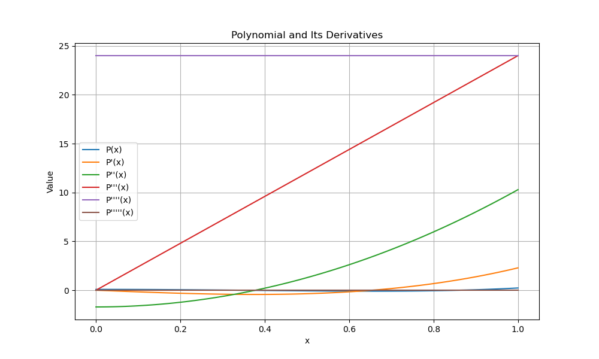

# Polynomial Manipulation and Differentiation Project Summary

## Approach

The project aimed to implement a C++ program for manipulating and differentiating polynomials using modern C++ practices. The solution involved the following key components:

1. **Node Structure**: A `Node` class was created to represent elements of a polynomial, including constants, variables, and operators. To manage the dynamic memory efficiently, smart pointers (`std::shared_ptr`) were used, which eliminated the need for manual memory management (i.e., `new`/`delete`). This ensured better memory safety and followed modern C++ best practices.

2. **Polynomial Binary Tree**: The polynomial was represented using a binary tree structure (`PolynomialBinaryTree` class), where nodes could represent constants, variables, or operators. This tree structure facilitated operations such as polynomial evaluation and differentiation. Operator nodes were linked to left and right child nodes, allowing nested polynomial expressions.

3. **Differentiation**: The differentiation was implemented recursively by traversing the binary tree. For constants, the derivative was zero; for variables, it was one; and for products, the product rule was applied. This ensured correctness for both simple and complex polynomial expressions.

4. **Evaluation**: The polynomial was evaluated at specific points within the interval `[0, 1]`. A recursive evaluation method was implemented to compute the polynomial's value based on its binary tree representation.

5. **Saving Results**: The polynomial and its first five derivatives were evaluated at 100 points within the range `[0, 1]`. The results were saved to a file (`polynomial_evaluation.txt`) in a structured format to facilitate visualization.

6. **Defining Polynomials by Zeros**: A function was developed to define polynomials based on given zeros, allowing easy generation of polynomials for testing and evaluation. This function created a product of linear terms corresponding to each zero.

## Challenges and Solutions

1. **Memory Management**: One of the challenges was managing the dynamic memory efficiently without memory leaks. This was addressed by using smart pointers (`std::shared_ptr`), which automatically handle memory allocation and deallocation.

2. **Recursive Differentiation and Evaluation**: Implementing the differentiation and evaluation functions required careful recursive logic. Handling different node types (constants, variables, operators) was crucial, and the challenge was to ensure correctness across different types of polynomial structures. This was solved by implementing a switch-case structure to handle each node type properly.

3. **Polynomial Definition Flexibility**: Defining polynomials by specifying their zeros posed a challenge in terms of ensuring a flexible and modular design. To address this, the function was designed to take a vector of zeros and construct the corresponding polynomial tree, ensuring it could handle repeated and varied inputs.

4. **Range Handling**: The initial implementation evaluated polynomials in the range `[-1, 1]`, but the project required evaluation in the range `[0, 1]`. This was corrected by updating the evaluation loop to ensure `x` values were within the correct range.

## Conclusion

The project successfully implemented polynomial manipulation and differentiation using modern C++ practices, achieving efficient memory management, correctness in operations, and structured output. The challenges encountered were addressed by adopting a recursive approach and utilizing modern C++ features like smart pointers, resulting in a robust and flexible solution.

## Visualization

To better understand the behavior of the polynomials and their derivatives, a plot was generated. The file `polynomial_derivatives_plot.pdf` contains visual representations of the polynomial and its first five derivatives evaluated at 100 points within the range `[0, 1]`. This visualization helps in analyzing the changes and trends in the polynomial's behavior across the specified interval.

