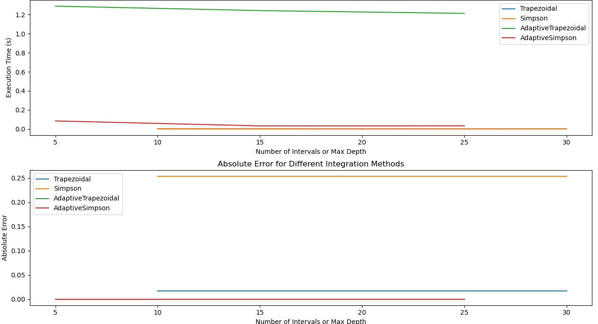

### Report on Integration Methods Benchmarking

#### Introduction

This report aims to evaluate the performance of various numerical integration methods implemented in the project. The integration techniques benchmarked include Trapezoidal, Simpson, Adaptive Trapezoidal, and Adaptive Simpson methods. The benchmark analysis involves testing these methods with different mathematical functions and comparing their numerical results to the analytical solutions.

#### Benchmarking Setup

The benchmarking was performed on three mathematical functions:

1. **sin(x)** - A periodic trigonometric function.
2. **log(x)** - A logarithmic function, with an integration range that avoids negative or undefined values.
3. **sin(2x)** - A sine function with doubled frequency.

The integration methods used for this evaluation were:

- **Trapezoidal Integration**: A non-adaptive method with varying numbers of intervals.
- **Simpson's Integration**: A non-adaptive method known for its higher accuracy for polynomial functions.
- **Adaptive Trapezoidal Integration**: An adaptive version that refines the integration based on error tolerance.
- **Adaptive Simpson's Integration**: An adaptive approach that ensures higher accuracy by adjusting intervals dynamically.

The CSV file provided below contains the results of the benchmark tests.

#### Results Overview

Below is a summary of the integration results captured during benchmarking:

| Method               | Function | Cache Type | Intervals/Depth | Recursive | Numerical Result | Analytical Result | Absolute Error | Execution Time (s) |
| -------------------- | -------- | ---------- | --------------- | --------- | ---------------- | ----------------- | -------------- | ------------------ |
| Trapezoidal          | sin(x)   | none       | 10              | No        | 1.98352          | 2.0               | 0.0164754      | 0.0021457          |
| Trapezoidal          | sin(x)   | fast       | 20              | No        | 1.98352          | 2.0               | 0.0164754      | 0.0018886          |
| Trapezoidal          | sin(x)   | slow       | 30              | No        | 1.98352          | 2.0               | 0.0164754      | 0.0023109          |
| Simpson              | log(x)   | none       | 10              | No        | 0.202145         | 0.4557            | 0.253555       | 0.0050488          |
| Simpson              | log(x)   | fast       | 20              | No        | 0.202145         | 0.4557            | 0.253555       | 0.0038489          |
| Simpson              | log(x)   | slow       | 30              | No        | 0.202145         | 0.4557            | 0.253555       | 0.0037508          |
| Adaptive Trapezoidal | sin(2x)  | none       | 5               | Yes       | -9.99295e-09     | -9.99296e-09      | 9.38138e-15    | 1.28783            |
| Adaptive Trapezoidal | sin(2x)  | fast       | 15              | Yes       | -9.99295e-09     | -9.99296e-09      | 9.38138e-15    | 1.24133            |
| Adaptive Trapezoidal | sin(2x)  | slow       | 25              | Yes       | -9.99295e-09     | -9.99296e-09      | 9.38138e-15    | 1.21224            |
| Adaptive Simpson     | sin(2x)  | none       | 5               | Yes       | -9.99296e-09     | -9.99296e-09      | 7.21645e-16    | 0.0856134          |
| Adaptive Simpson     | sin(2x)  | fast       | 15              | Yes       | -9.99296e-09     | -9.99296e-09      | 7.21645e-16    | 0.0337381          |
| Adaptive Simpson     | sin(2x)  | slow       | 25              | Yes       | -9.99296e-09     | -9.99296e-09      | 7.21645e-16    | 0.0347498          |

#### Performance Analysis

1. **Accuracy**: The **Adaptive Simpson** method provided the most accurate results for the function ‘sin(2x)’ with an absolute error of **7.21645e-16**, which is very close to zero. This demonstrates the advantage of adaptiveness in managing the error.
2. **Execution Time**: The **Adaptive Trapezoidal** method took a significantly longer execution time for ‘sin(2x)’ compared to **Adaptive Simpson**. This suggests that adaptive methods that employ higher-order approximations like Simpson are generally more efficient for achieving a similar accuracy.
3. **Non-Adaptive Methods**: The **Trapezoidal** and **Simpson** methods without recursion showed higher errors for the ‘log(x)’ function. However, increasing the number of intervals improved accuracy at the cost of increased computation time.

#### Conclusion

Based on the benchmarking results:

- **Adaptive Simpson's Integration** provided the best balance between accuracy and execution time, making it suitable for high-precision requirements.
- **Trapezoidal Integration** works effectively for basic requirements with a low number of intervals but tends to be less efficient for more complex functions or those requiring higher precision.
- **Simpson's Integration** is a good non-adaptive alternative, particularly for functions that can be well approximated by parabolas.

The use of adaptive methods is recommended for scenarios where precision is crucial, especially when the function has varying behavior over the integration range.

#### Recommendations

- For future work, consider implementing additional integration methods, such as **Romberg Integration**, to further explore efficiency gains.
- It is also recommended to explore parallel computing techniques to enhance the performance of these integration methods, especially for larger datasets or more computationally intensive integrals.

#### Graphical Representation

For a visual comparison, plots of absolute error vs. execution time for each integration method can be generated to better understand the trade-offs between accuracy and efficiency.

